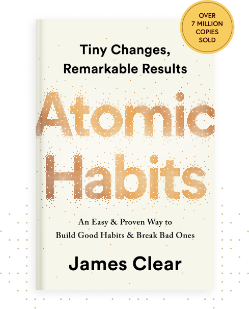

## Atomic Habits - by james clear

### Aggregation of marginal gains gives compounding results over the years

Example: 
Uk cycling team did marginal improvements and won back to back medals in 2008 and 2012 breaking 100 years curse.

Goals vs system.
> Follow system if you want to retain long term goals.

* Outcome based habit- less effective
* Identity based- more effective examples i am non smoker

* Decide what type of person you want to be and start behaving that way and start marginal improvements there.

## Habit Formation:
Cue - make them visible easily accessible
Example while reading books keep them near you and use bookmarks
Craving - attractive
Response - 
Reward - make them satisfactory and visible rewards

Visually measure your progress is very effective. Habit tracking is important.

Human brain like challenges but only those which are optimal for our capacity.
Example: play tennis with 10yr kid - get bored
Play with serena williams- loose motivation

Hence we need to pick a lil more than our comfortable zone.

Boredom kills ambition- but expert says successful people change 

#learnings

*Thank You*