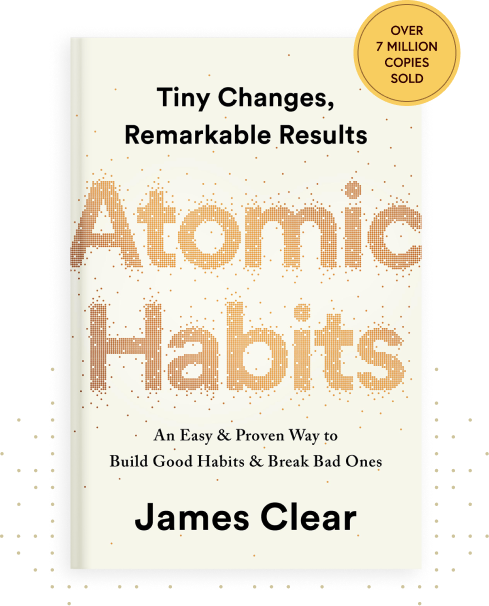

## Atomic Habits - Small Wins, Compounding Results

James Clear argues that the quality of our lives depends on the quality of our habits. We don't rise to the level of our goals; we fall to the level of our **systems**.

### 1. The Power of Compounding
A 1% improvement every day makes you 37 times better by the end of the year. This is the **Aggregation of Marginal Gains**. 
*   Example: The UK cycling team won back-to-back medals after decades of failure by improving everything (seats, tires, even pillows) by just 1%.

### 2. Identity-Based Habits
Most people focus on *outcomes* (e.g., "I want to lose weight"). Instead, focus on *identity* (e.g., "I am the type of person who never misses a workout"). Every action you take is a vote for the person you wish to become.

### 3. The 4 Laws of Behavior Change
To build a good habit, follow these laws:
1.  **Make it Obvious**: Use "Environment Design." If you want to read more, put a book on your pillow.
2.  **Make it Attractive**: Use "Temptation Bundling." Only watch your favorite show while on the treadmill.
3.  **Make it Easy**: Use the **2-Minute Rule**. If a habit takes less than 2 minutes, do it now.
4.  **Make it Satisfying**: Use habit tracking to visualize your wins.

### 4. The Goldilocks Rule
The human brain loves challenges, but only if they are "just right." If a task is too easy, you get bored; if it's too hard, you lose motivation. Aim for the zone just outside your comfort.

#learnings

