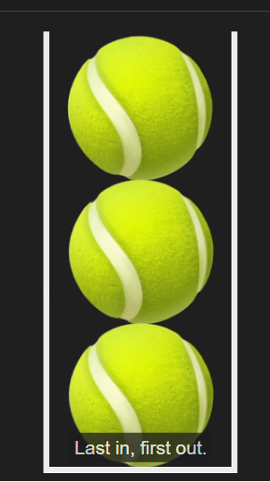

## Stacks

Stacks usually have these two methods
1. push 
2. pop

Because of the way it is, no other method like replace , insert,etc makes sense here



and you can say thank you to god, being JS developer, you already know these two methods are present in Arrays.

So we will be using linkedlist to create the stack, In linked list we had haed and tail, here we will have top and bottom.
but you know what - we dont need bottom, as its fixed and cannot be moved

```Javascript
class Node {
     constructor(value){
         this.value = value
         this.next = null
     }
 }
 
 class Stack {
     constructor(value) {
         const newNode = new Node(value)
         this.top = newNode
         this.length = 1
     }
 
     push(value) {
         const newNode = new Node(value)
         if(this.length === 0) {
             this.top = newNode
         } else {
             newNode.next = this.top
             this.top = newNode
         }
         this.length++
         return this 
     }
 
     pop() {
         if(this.length === 0) return undefined
         let temp = this.top
         this.top = this.top.next
         temp.next = null
         this.length--
         return temp
     }
 }
 
 let myStack = new Stack(7)
 myStack.push(23)
 myStack.push(3)
 myStack.push(11)

```


## Queues

When bottom of the stack (tennis ball pack) breaks due to heavy load, you keep it on the floor, making it a queue.

When you get in the line to buy ticket, it's a queue.

For arrays push & pop is o(1) but unshift & shift o(n)
In LinkedList, shift , unshift is o(1) and pop is o(n)
In queues, if you design carefully, you get both in o(1) you need to add from one end, remove from other.


FIFO


```Javascript
class Node {
     constructor(value){
         this.value = value
         this.next = null
     }
 }
 
 class Queue {
     constructor(value) {
         const newNode = new Node(value)
         this.first = newNode
         this.last = newNode
         this.length = 1
     }
 
     enqueue(value) {
         const newNode = new Node(value)
         if (this.length === 0) {
             this.first = newNode
             this.last = newNode
         } else {
             this.last.next = newNode
             this.last = newNode
         }
         this.length++
         return this
     }
 
      dequeue() {
         if(this.length === 0) return undefined
         let temp = this.first
         if(this.length === 1) {
             this.first = null
             this.last = null
         } else {
             this.first = this.first.next
             temp.next = null
         } 
         this.length--
         return temp
     }   
 }
 
 let myQueue = new Queue(11)
 myQueue.enqueue(3)
 myQueue.enqueue(23)
 myQueue.enqueue(7)
```