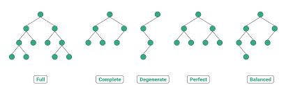

````

                                               
                  v .   ._, |_  .,
            `-._\/  .  \ /    |/_
                   \\  _\, y | \//
            _\_.___\\, \\/ -.\||
               `7-,--.`._||  / / ,
             /'     `-. `./ / |/_.'
                        |    |//
                        |_    /
                        |-   |
                        |   =|
                        |    |
    -------------------/ ,  . \--------._

````

### So what is a tree?

A tree a linked list that doesn't fork.

A tree can be binary :  only left and right

Can be ternary or 10's nary



### Full Tree  
A tree with nodes has either 0 or 2 items

### Perfect Tree
A tree with all nodes having 2 items

### Complete tree
All the levels of the tree are completely filled, the last level of the binary tree may or may not be completely filled, but in the last level of the node, each node should be at the leftmost position


### Degenerate Binary Tree
Each node has only one child. It can be left children or right children


### Balance Binary Tree
Here the height of binary is log2 of the total number of nodes in that binary tree.

Let the h is the height of the tree and n is the number of nodes of the tree. Then h = log(n).


## BST - Binary Search Tree

Binary search tree is different from tree, all the nodes lesser than parent node comes on left and greater than comes on right. 

| Linked List      |  Binary Tree         | Operation
| ------------- |:-------------:| -----|
| o(1)      | o(Log n) | Insert
| o(n)      | o(Log n)| Lookup
| o(n)      | o(Log n) | Remove

```Javascript
class Node {
     constructor(value) {
         this.value = value
         this.left = null
         this.right = null
     }
 }
 
 class BST {
     constructor() {
         this.root = null
     }

     insert(value) {
          const newNode = new Node(value)
          if (this.root === null) {
              this.root = newNode
              return this
          }
          let temp = this.root
          while(true) {
              if (newNode.value === temp.value) return undefined
              if (newNode.value < temp.value) {
                  if (temp.left === null) {
                      temp.left = newNode
                      return this
                  }
                  temp = temp.left
              } else {
                  if (temp.right === null) {
                      temp.right = newNode
                      return this
                  } 
                  temp = temp.right
              }
          }
      }

        contains(value) {
          if (this.root === null) return false
          let temp = this.root
          while(temp) {
              if (value < temp.value) {
                  temp = temp.left
              } else if (value > temp.value) {
                  temp = temp.right
              } else {
                  return true
              }
          }
          return false
      }
 }


let myTree = new BST()
myTree.insert(47)
myTree.insert(21)
myTree.insert(76)
myTree.insert(18)

myTree.insert(52)
myTree.insert(82)

```