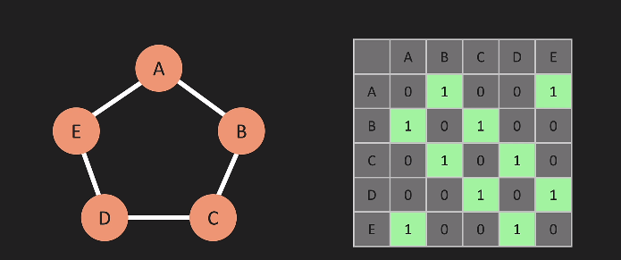
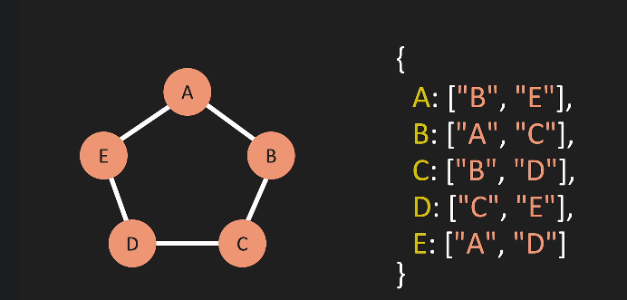

A graph is a data structure that consists of the following two components: 
1. A finite set of vertices also called as nodes. 
2. A finite set of ordered pair of the form (u, v) called as edge.


A binary tree is a graph - limitation it can point to only 2 nodes

Linked List are trees and trees are graphs , meaning linked list is also a graph

Graphs are used to represent many real-life applications: Graphs are used to represent networks. The networks may include paths in a city or telephone network or circuit network. Graphs are also used in social networks like linkedIn, Facebook. For example, in Facebook, each person is represented with a vertex(or node).

The following two are the most commonly used representations of a graph. 
1. Adjacency Matrix 


 #### Storing things in Adjacency matrix is *not* very efficient due to huge number of zeros to be stored when it goes large, hence lets see Adj list:

2. Adjacency List 



Let's get to code it

````javascript
class Graph {
    constructor() {
        this.adjacencyList = {}
    }

    addVertex(vertex) {
        if(!this.adjacencyList[vertex]) {
            this.adjacencyList[vertex] = []
            return true
        }
        return false
    }

    addEdge(vertex1, vertex2) {
        if (this.adjacencyList[vertex1] && this.adjacencyList[vertex2]) {
            this.adjacencyList[vertex1].push(vertex2)
            this.adjacencyList[vertex2].push(vertex1)
            return true
        }
        return false
    }

    removeEdge(vertex1, vertex2) {
        if (this.adjacencyList[vertex1] && this.adjacencyList[vertex2]) {
            this.adjacencyList[vertex1] = this.adjacencyList[vertex1]
                .filter(v => v !== vertex2)
            this.adjacencyList[vertex2] = this.adjacencyList[vertex2]
                .filter(v => v !== vertex1)
            return true
        }
        return false
    }

    removeVertex(vertex) {
        if (!this.adjacencyList[vertex]) return undefined
        while(this.adjacencyList[vertex].length) {
            let temp = this.adjacencyList[vertex].pop()
            this.removeEdge(vertex, temp)
        }  
        delete this.adjacencyList[vertex] 
        return this
    }
}


let myGraph = new Graph()

myGraph.addVertex("A")
myGraph.addVertex("B")
myGraph.addVertex("C")
myGraph.addVertex("D")
myGraph.addEdge("A", "B")
myGraph.addEdge("A", "C")
myGraph.addEdge("A", "D")
myGraph.addEdge("B", "D")
myGraph.addEdge("C", "D")

````