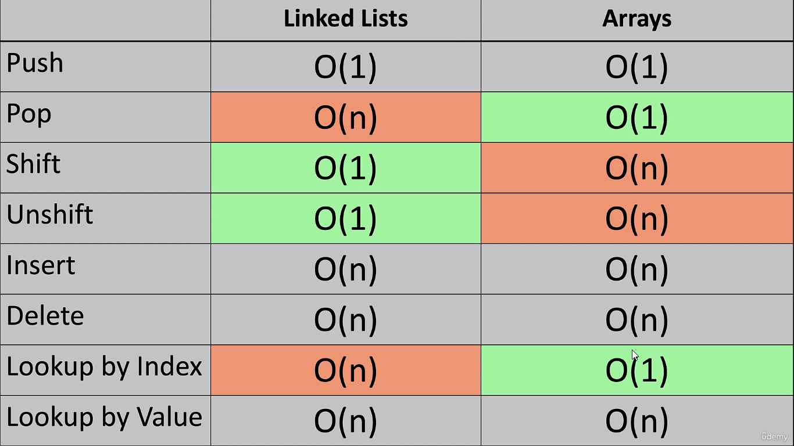

## Why need for DSA?

If you are reading this, than you already  know the why we need it. We are discussing a few topics here, connect with me if you want to know more

### Linked List

Its different from Array in terms of performance
1. No indexes
2. can store any type of data
3. shift and unshift takes only n(1)

Linked lists are often used because of their efficient insertion and deletion. They can be used to implement stacks, queues, and other abstract data types.



As per [GFG](https://www.geeksforgeeks.org/implementation-linkedlist-javascript/)
>LinkedList is the dynamic data structure, as we can add or remove elements at ease, and it can even grow as needed. Just like arrays, linked lists store elements sequentially, but don't store the elements contiguously like an array


```javascript
//create a node
class Node {
    constructor(value) {
        this.value = value;
        this.next = null;
    }
}

//actual ll class which consumes node
class LinkedList {
    constructor(value) {
        this.node = new Node(value)
        
    }
}

const a = new LinkedList(4);
console.log(a);
````