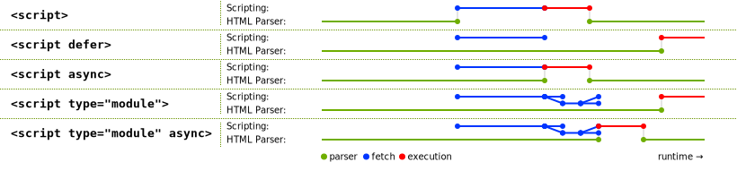

I think no one should ever start any langaguge with learning data types.
They sound so silly and scarry , why the hell would I bore someone with JS data types.


___


JS is loaded in browser via the:
### Script tag ### 

`<script src="example.js"></script>`

Attribute |  What it does |  &nbsp;
---|---|---
async | Load and Execute script immediately | Default async=true, example: ads, counters etc can download and run independendly
defer | Load in order and Execute after the document is loaded | defer is used for scripts that need the whole DOM and/or their relative execution order is important.
integrity | verification of Subresource Integrity (SRI) | useful for ensuring that a Content Delivery Network CDN is not serving malicious payloads
type | Deprecaed- "text/javascript" & "text/ecmascript" Added - "module" |  JavaScript module. The processing of the script contents is not affected by the charset and defer attributes

Summary:

<!--  -->




___

### Data Types ###

The set of types in the JavaScript language consists of primitive values and objects.

Primitive values (immutable)
1) Boolean type
2) Null type
3) Undefined type
4) Number type
5) BigInt type
6) String type
7) Symbol type

Non Primative:

8. Objects (collections of properties)


### Execution Context

Everything in JS happens inside execution context
 
 
 ### How memory is allocated in JS?: 
 
 *  1st phase : Memory creation ( it hoists all var and functions) 
 *  2nd phase : Call stack (Maintain order of execution)
 
 So you can open a debugger and see how it works
 
 ### Get name context created in call stack:
 
 
 ### getName context removed and global context(ananomous) is back after completing previous function
 
 
 
###  "use strict"
 ##### Strict mode can be defined inside function (function scoped instead of global)
 Benifits of use strict:
 1) without using strict mode you can end up debugging code for undeclared variable
 use strict - helps preventing accidental global declaration
 
 
 2) Deletion not possible of variables, functions and arguments when using strict mode
 ```javascript
 "use strict"
var foo =1;
console.log(foo);
delete foo
console.log(foo);
```
````
Uncaught SyntaxError: Delete of an unqualified identifier in strict mode
````
 
 3) eval is relatively safe to use in strict mode - because it doesnt leak scope out of its execution context
 
 4) It blocks global this usage
 
 ### Does javascript pass variables by reference or by value?
 primitives are passed by value
 objects are by reference
 
 ### 3) ...Rest operator : as the name suggest it is rest of the remaining items in argument, so should be in the last, if it is the only argument then it converts everything into array
 
 ### 4) Template literal
1)    They provide power to tag
[ arpit\`pass\` ] arpit is a tag here
    ````arpit`pass` 
    means 
    function arpit('pass'){}````
 2) ${any expression} can be used 
 3) multi line can be used literaly
 
 ### NaN how to check?
 a!==a is the only way to check 
 we cannot rely on isNaN() coz 
 ```isNaN("a")``` // true : this is actully incorrect
 ```isNan(Number("a"))``` : this is what is happening internally because of which about seems true
 
 so best way to check is
 (a!==a)
 
 
 ### Scoping of **var let and const**
 var follows global scope
 let & const uses block scope
 
 so when you do a 

 ```
 `for(var i=0;i+...)`
 this `i`is accessible outside for block, but when you use let const its not available
 
 for(let i = 0;i<10;i++){
// console.log(i)
}
console.log(i,'dd')//Uncaught ReferenceError: i is not defined
 ```
 
  ```
 for(var i = 0;i<10;i++){
// console.log(i)
}
console.log(i,'dd')//10
 ```
 
 ### Break vs Continue
 In for loop
 break : breaks entire loop
 continue: conitnues to next iteration
 
 ### For in : for looping on objects   (break & continue doesnt work here)
 ### For of : for looping on arrays    (break & con works here)
 ### array.forEach : for arrays but break, cont doesnt work - use return instead
 
 ### Bind can only be used on functions after they have been created and assigned to a variable
 ____
 
 ## Prototype
 Each object has a prototype which is denoted in es6 by \___proto\___ property, earlier to es6 it was created by Object.create()
 ```
var human = {  kind: 'homosapeins'}
```
__Create Proto via:__
````var arpit =  Object.create(human,{type:{value:'shy'}})````
__OR__
````var arpit =  {type:'shy'} ;  arpit.__proto__ = human````

    
 
 ### Prototypal vs Classical inheritance
 All inheritance in js is protoypal , nothing is classical
 
 
 
 * Functions have _prototype_ property
 *  Objects have \__proto\__ property
 *  Using Prototype always refer to same object, so it saves memory

protoytypical pattern  =  blabla.prototype.something = Object.create(jiska banana he)
constructor pattern =  new Something()

Advantage with constructor pattern is that somewhat you can mimick private variables 


Answer below?


Looping over own object's property is called as **Reflection**


Object's prototype _ _proto__ is different than Function's prototype Abc.prototype

when we call **new** function , new create new physical object. which will have function as one of its keys.

Dont for(var a in Array) coz it also loops over object properties like suppose you added a use__proto__ function etc. use i=0,i<1 etc for array.
hope samajh me aya hoga, nahi to kar ke dekh


Object . Create Polyfill using es5

````
if (typeof Object.create !== 'function') {
 Object.create = function(o, props) {
  function F() {}
  F.prototype = o;

  if (typeof(props) === "object") {
   for (prop in props) {
    if (props.hasOwnProperty((prop))) {
     F[prop] = props[prop];
    }
   }
  }
  return new F();
 };
}
````

### Promises can be chained or forked
#### Chained:
```var a = Promise.resolve("ok").then(...)```

#### Forked:
```
var a = Promise.resolve("ok")
    a.then("do this")
    a.this("amd this")
```

 ### Diff bw asynawait and promised
 * Await/async : block the code and wait for results
 * Promised: continue to go to next line and come back when its resolved
 
 
 
 
 
 
 asd
 
 
 windows.onerror : used to detect errors on ui and send data 
 

### Event Capture vs Event Bubbling


### As per MDN:
>  __In the capturing phase:__
    The browser checks to see if the element's outer-most ancestor html has an onclick event handler registered on it for the capturing phase, and runs it if so.
    Then it moves on to the next element inside html and does the same thing, then the next one, and so on until it reaches the element that was actually selected.
    __In the bubbling phase__: the exact opposite occurs:
    The browser checks to see if the element selected has an onclick event handler registered on it for the bubbling phase, and runs it if so.
    Then it moves on to the next immediate ancestor element and does the same thing, then the next one, and so on until it reaches the html element.


___


### Execution Context

Everything happens inside execution context

 | Memory | Code |
 ---------|-------
 | all fun and variables set to undefined initially | execution context
 
 
 how memory is allocated : 
 
 1st phase : Memory creation ( it hoists all var and functions) 
 2nd phase :call stack
 
 call stack - maintain order of execution
 
 so you can open a debugger and see how it works
 
 ### Get name context created in call stack:
 
 
 ### getName context removed and global context(ananomous) is back after completing previous function
 
 
 
 
 

## Error Boundaries
A class component becomes an error boundary if it defines either (or both) of the lifecycle methods 
static getDerivedStateFromError() or 
componentDidCatch()


23/09/20
The for–in loop is for looping over object properties.

The for–of loop is for looping over data—like the values in an array

asd


In order to call a static method within another static method of the same class, you can use the this keyword.
The static keyword defines a static method for a class. Static methods aren't called on instances of the class. Instead, they're called on the class itself


# Notes from Dan Abramov's  Just JavaScript 
###### 24 may 2020
#
---


## Primitive Values Are Immutable


Try this 
```javascript
function double(x) {
  x = x * 2;
}
let money = 10;
double(money);
console.log(money); 

```


We can’t point variables to each other! Variables always point at values
let x = 10;
let y = x;
x = 0;

now what y??
>When we see an assignment, we “ask” the right side’s value, and point the left side’s “wire” at it.


## Data Types

**1. UNDEFINED**

>Don’t get too hung up on its name. It’s tempting to think of undefined as some kind of variable status, e.g. “this variable is not yet defined”. But that’s a completely misleading way to think about it! In fact, if you read a variable that was actually not defined (or before the let declaration), you will get an error:

```
console.log(jabberwocky); // ReferenceError!
let jabberwocky;
```
That has nothing to do with undefined.
Really, undefined is a regular primitive value, like 2 or "hello".

**2. NULL**

console.log(typeof(null)); // "object" (a lie!)
You might think this means null is an object. Don’t fall into this trap! It is a primitive value, and it doesn’t behave in any way like an object.

**3. NUMBER**

console.log(typeof(NaN)); // "number"
JavaScript implements a standard called “floating point math”. Its numbers are more precise closer to 0, and less precise further away from it.
Numbers resulting from invalid math operations like 1 / 0 or 0 / 0 are special. NaN is one of such special numbers.
typeof(NaN) is a number because it is a numeric value. It’s called “Not a Number” because it represents the idea of an "invalid" number.

Notice the output:
```
console.log(Number.MAX_SAFE_INTEGER);     // 9007199254740991
console.log(Number.MAX_SAFE_INTEGER + 1); // 9007199254740992
console.log(Number.MAX_SAFE_INTEGER + 2); // 9007199254740992
console.log(Number.MAX_SAFE_INTEGER + 3); // 9007199254740994
console.log(Number.MAX_SAFE_INTEGER + 4); // 9007199254740996
console.log(Number.MAX_SAFE_INTEGER + 5); // 9007199254740996
```
its goofing up, coz its more than number range,

**4. BigInt**

so for takling such probs, we have BigInt
let alot = 9007199254740991n; // Notice n at the end
console.log(alot + 1n); // 9007199254740992n
console.log(alot + 2n); // 9007199254740993n
console.log(alot + 3n); // 9007199254740994n
console.log(alot + 4n); // 9007199254740995n
console.log(alot + 5n); // 9007199254740996n

**5. Strings**

All strings have a few built-in properties.
```
let cat = 'Cheshire';
console.log(cat.length); // 8
console.log(cat[0]); // "C"
console.log(cat[1]); // "h"
```
This doesn’t mean that strings are objects! String properties are special and don’t behave the way object properties do. For example, you can’t assign anything to cat[0]. Strings are primitives, and all primitives are immutable

**6. Objects**
See the types below:
```
console.log(typeof({})); // "object"
console.log(typeof([])); // "object"
console.log(typeof(new Date())); // "object"
console.log(typeof(/\d+/)); // "object"
console.log(typeof(Math)); // "object"
```
Unlike everything before, objects are not primitive values. This also means that by default, they’re mutable. We can access their properties with . or []

You can’t destroy an object that you’ve created:
```javascript
let junk = {};
junk = null; // Doesn't necessarily destroy an object
delete junk; //false // Doesn't do anything (and errors in strict mode)
```

The delete operator removes a given property from an object. On successful deletion, it will return true, else false will be returned.

```javascript
const Employee = {
  firstname: 'John',
  lastname: 'Doe'
};


console.log(Employee.firstname);
// expected output: "John"

delete Employee.firstname;

console.log(Employee.firstname);
// expected output: undefined
```

**7. Function**

Every time we execute a line of code that contains a function declaration, a brand new function value is created.

---

## Equality
In JavaScript, there are several kinds of equality. If you’ve been writing JavaScript for a while, you’re probably familiar with at least two of them:

>Strict Equality: a === b (triple equals).
Loose Equality: a == b (double equals).
Same Value Equality: ```Object.is(a, b).```


        some exceptions to equality to learn:

1. NaN === NaN is false, although they are the same value.
2. -0 === 0 and 0 === -0 are true, although they are different values.

##### 1. Special case NaN
remember that NaN === NaN is always false
so when you do unitntenal things like, below:

let width = 0 / 0; // NaN
Further calculations with NaN will give you NaN again:
let height = width * 2; // NaN
if(width===height)  // this always fails

also below always fails, 
```
function resizeImage(size) {
  if (size === NaN) {
    // Doesn't work: the check is always false!
    console.log('Something is wrong.');
  }
  // ...
}
```

##### so, solution :

* Number.isNaN(size)
* Object.is(size, NaN)
* size !== size

which means you need to write above code like this:
if(width!==height)  // this always succeed for NaN

##### 2. Another special case:  -0
let width = 0; // 0
let height = -width; // -0
console.log(width === height); // true
However, 0 is a different value from -0:
console.log(Object.is(width, height)); // false

from [MDN](https://developer.mozilla.org/en-US/docs/Web/JavaScript/Equality_comparisons_and_sameness?ck_subscriber_id=701811795#Loose_equality_using)
> **When to use Object.is versus triple equals**
In general, the only time Object.is's special behavior towards zeros is likely to be of interest is in the pursuit of certain meta-programming schemes, especially regarding property descriptors, when it is desirable for your work to mirror some of the characteristics of Object.defineProperty. If your use case does not require this, it is suggested to avoid Object.is and use === instead. Even if your requirements involve having comparisons between two NaN values evaluate to true, generally it is easier to special-case the NaN checks (using the isNaN method available from previous versions of ECMAScript) than it is to work out how surrounding computations might affect the sign of any zeros you encounter in your comparison.

### Use of ==
Most cases it is advisable to ignore
There is one usage of it that is relatively common and is worth knowing:

```

if (x == null) {
  // ...
}
This code is equivalent to writing:
if (x === null || x === undefined) {
  // ...
}
```

---

## Properties
Meet Sherlock Holmes, a world-renowned detective from London:
             ````   let sherlock = {
                  surname: 'Holmes',
                  address: { city: 'London' } 
                };````
His friend John Watson has recently moved in to live with Sherlock:
            ````
            let john = {
              surname: 'Watson',
              address: sherlock.address
            }; ````
Sherlock is a brilliant detective but a difficult flatmate. One day, John decides he’s had enough. John changes his surname and moves to live in Malibu:
                ````             
                john.surname = 'Lennon';
                john.address.city = 'Malibu';
                ````
Time for a small exercise. Write down your answers to these questions:
console.log(sherlock.surname); // ?
console.log(sherlock.address.city); // ?
console.log(john.surname); // ?
console.log(john.address.city); // ?


explanation picture saved on desktop

Now let’s check your answers:
console.log(sherlock.surname); // "Holmes"
console.log(sherlock.address.city); // "Malibu"
console.log(john.surname); // "Lennon"
console.log(john.address.city); // "Malibu"
This is not a typo — they are indeed both in Malibu.

##### Property rules:

1. Figure out the value of the part before the dot (.).
2. If that value is null or undefined, throw an error immediately.
3. Check whether a property with that name exists in our object.
a. If it exists, answer with the value this property points to.
b. If it doesn’t exist, answer with the undefined value.


08. ## Mutation

#### Objects might appear “nested” in code, but in our universe each object is completely separate. An object cannot be “inside” of other object!


8) how to support old broweser having no html5 capabilities:

Answer:  if you put an unknown element into a web page, by default the browser will just treat it like a span, ie, an anonymous inline element.

 step 1: insert a line of JavaScript into the head of your document, like so:

<script>
		document.createElement('article');
		document.createElement('section');
</script>

step2: set them to display:block; in your CSS:

article, section, aside, hgroup, nav, header, footer, figure, figcaption {
	display: block;
}


Soutuion 2: use  HTML5 Shiv:
HTML5 Shiv enables use of HTML5 sectioning elements in legacy Internet Explorer and provides basic HTML5 styling for Internet Explorer 6-9, Safari 4.x (and iPhone 3.x), and Firefox 3.x.
--------->html5shiv.js : this will internally create element for you and other patches for ie6-9
--------->html5shiv-printshiv.js : all above plus and additional styles for printing
----------> it will by default ship with html5.shivCSS which will basically do display:block for new elements and other styling

Solution 3: use Modernizer:
---------> this will already include htmlshiv in it
----------> Modernizr uses feature detection like Web Workers, Local Storage, Session, websql,script[defer],Low Bandwidth Connection, CSS Transforms and transitions, flexbox, canvas, emoji, Battery API	etc

so u can write ur code like:

 if (Modernizr.batteryAPI) {
    showOffAwesomeNewFeature();
  } else {
    getTheOldLameExperience();
  }


----------->Modernizr sets classes for all of your tests on the root element

example : include Modernizr's detection for CSS gradients--->
: so it will result in either  

```

<html class="cssgradients"> or <html class="no-cssgradients">.

```
: so now u can write CSS to cover both cases

```
.no-cssgradients .header {
  background: url("images/glossybutton.png");
}


.cssgradients .header {
  background-image: linear-gradient(cornflowerblue, rebeccapurple);
}

```

so hows feature detection is diffrent from UA sniffing

UA sniffing is something like this : 
```
if (browser === "the-one-they-make-you-use-at-work") {
    getTheOldLameExperience();
  } else {
    showOffAwesomeNewFeature();
  }
```
--->???what if the next version of that browser adds support for Awesome-New-Feature™? Now you have to go back and audit your code, updating every single place 

--->??user can go into their browser and OS settings and change the name of the browser and then ur code will eventually break

So in order to prevent urself from above situation use modernizer which will actually do feature detection and u will be returned true or false


Respond.js:polyfill for min/max-width CSS3 Media Queries (for IE 6-8) only this is the functionality of respond


## JavaScript function hoisting
	https://gist.github.com/maxogden/4bed247d9852de93c94c


## Page loading:

When page loading is complete that time you can know without jquery:
>>document.readyState---> this will return "complete" when finished loading all, "loading" when its still loading , "interatcive" when finished loading and the document has been parsed but sub-resources such as images, stylesheets and frames are still loading......and this is the state where DOMContentLoaded event is fired..
so another appraoch is to listen for this event on body like:

```
<script>
  document.addEventListener("DOMContentLoaded", function(event) {
    console.log("DOM fully loaded and parsed");
  });

for(var i=0; i<1000000000; i++)
{} // this synchronous script is going to delay parsing of the DOM. So the DOMContentLoaded event is going to launch later.
</script>

```


or use DOMContentReady to know if its ready

innerHTML vs outerHTML:
http://www.java2s.com/Tutorials/JavascriptDemo/f/find_out_the_difference_between_innerhtml_and_outerhtml_in_javascript_example.htm


This has made me crazy:
1)
```
x = 1;
(function() {
    x = 2;
    if (true) {
        var x = 3;
    }
    function f1() {
        x = 4;
    }
    f1();
})();
console.log(x);
```
2)
```
x = 1;
(function() {
    x = 2;
    if (true) {
        x = 3;
    }
    function f1() {
        var x = 4;
    }
    f1();
})();
console.log(x);

```
```
var str='';empty string
if(str){console.log('ok')}
else{console.log('no')}---> o/p no

var str=' ';valid string with space
if(str){console.log('ok')}else{console.log('no')}
-->o/p ok

```