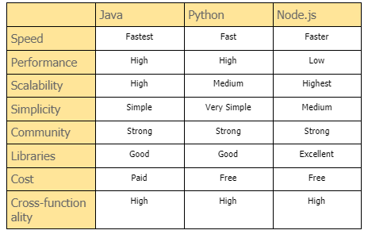

# Intro

I haven't met anyone to date whose childhood dream was to become a software developer. But as we grow up, we realize that it pays well.

I am a JavaScript fan. Why? Is it because it's fancy? No, I know Java too. In fact, I am an Oracle Certified Java developer. Is the reason it's easy to learn? No, Python has a much easier learning curve. Then why?

'Write once, run anywhere.' You may have heard this for Java, right? Wrong - Java doesn't run in the browser. JavaScript does. In the browser and everywhere else.

Web, app, server - all can host the codebase in the same language (JS), bringing your development cost and headaches down.

Remember the days of the 2000s when PCs used to have tons of software for different purposes like browsers, music players, video players, MS Office, Adobe Suite, etc.? All of these are comfortably knocked down by something like ChromeOS or just a laptop with Chrome on it.

Back to the present - aren't the mobile phones of today the same thing as the desktops of yesterday and apps the same things as old software? What do you think is going to happen next? History repeats itself. I already have the web version of Amazon, OYO, Myntra installed on my phone as apps, and they feel better than native apps.

The web is powerful, and JavaScript is its fuel.

<!-- 
## Start by reading topics on your left

Get started by **creating a new site**.

Or **try Docusaurus immediately** with **[docusaurus.new](https://docusaurus.new)**.

## Generate a new site

Generate a new Docusaurus site using the **classic template**:

```shell
npm init docusaurus@latest my-website classic
```

## Start your site

Run the development server:

```shell
cd my-website

npx docusaurus start
```

Your site starts at `http://localhost:3000`.

Open `docs/intro.md` and edit some lines: the site **reloads automatically** and display your changes. 
-->

Just for  comparisons


